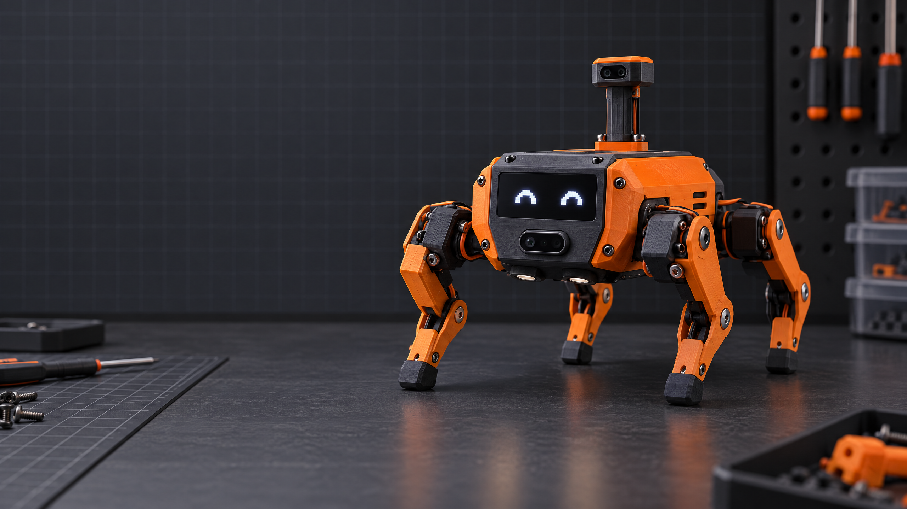
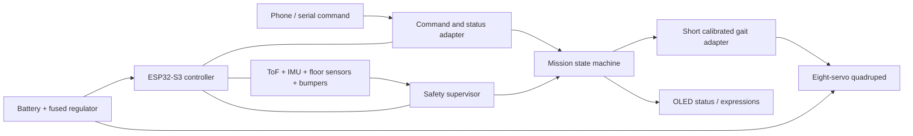

# KESTREL Scout

**A tiny quadruped that senses first and steps carefully.**

> **Project status: early prototype.** This repository currently contains a tested, hardware-independent C++ behavior core and a design/funding plan. The robot has **not** yet been assembled or validated. CAD, wiring, board-specific sensor integration, and physical test evidence are waiting on the maker's supplied models and hardware work.

<!-- Concept illustration only — proposed design, not a photo of a built prototype. -->
<p align="center">
  
</p>
<p align="center"><sub>Concept illustration only — appearance and unvalidated sensor pod are aspirational. See the project status before using or funding.</sub></p>

<p align="center">
  <a href="LICENSE"></a>
  <a href="firmware/kestrel-core"></a>
  <a href="docs/PROJECT_STATUS.md"></a>
  <a href="https://github.com/jarvasai/kestrel-scout/actions/workflows/test-core.yml"></a>
</p>

## The idea

KESTREL is a proposed low-cost, open-source **indoor scout robot** built from a small printable quadruped. It extends the approachable Sesame Robot foundation with a sensor-driven behavior loop: take a short step, re-check the surroundings, stop when a hazard or sensor fault is detected, and report what the robot currently knows.

The ambition is advanced autonomy **within an honest maker-scale boundary**. Version 1 targets slow demonstrations on a flat, bounded floor—not mapping, stairs, outdoor use, person-following, or unsupervised operation around people and pets.

## Why it is different

| Maker need | KESTREL approach |
| --- | --- |
| See what a small robot senses | Front time-of-flight ranging, tilt telemetry, and calibrated downward-facing floor sensors |
| Make behavior understandable | A simple, inspectable state machine rather than an opaque promise of “AI” |
| Fail more carefully | Short interruptible movement bursts, a latched stop, and fail-closed handling for stale critical sensor data |
| Change the mission without rebuilding the whole robot | Sesame-style web/API control remains the intended command path; a printed modular sensor bay is planned |
| Build within a constrained grant | Target parts-and-tools estimate is $331 plus a $69 shipping/tax/price reserve, under a $400 cap **only if** a suitable used printer can be found for at most $130 |

## What exists now

- A portable C++11 behavior supervisor in [`firmware/kestrel-core/`](firmware/kestrel-core/).
- Host tests for obstacle choice, burst timing and interruption, emergency stop, possible edge detection, tilt, stale readings, and safe fault reset.
- The documented prototype concept and budget in [`docs/PROJECT_PLAN.md`](docs/PROJECT_PLAN.md).
- A CAD handoff area ready for the maker's original files in [`hardware/cad/source/`](hardware/cad/source/).
- A CI workflow that compiles and runs the host tests on pushes and pull requests.

**Not implemented yet:** Arduino/ESP32 sensor drivers, a tested pin map, servo/gait adapter, battery telemetry, mobile UI, assembled robot, validated edge stopping distance, or physical test results. These remain explicit milestones, not existing features.

## System concept



The checked-in behavior core implements only the **policy layer**. It does not directly actuate motors. The future board adapter must preserve hard stop behavior, validated servo limits, and sensor timeouts before autonomy is connected to real hardware.

See the [architecture note and full-size diagram](docs/ARCHITECTURE.md).

## Quick start: run the core tests

Prerequisite: a C++11 compiler such as `g++`.

```sh
g++ -std=c++11 -Wall -Wextra -Werror \
  firmware/kestrel-core/KestrelCore.cpp \
  firmware/kestrel-core/tests/test_kestrel_core.cpp \
  -o /tmp/kestrel-core-tests
/tmp/kestrel-core-tests
```

Expected result: `All KESTREL core tests passed.` These are **software policy tests**, not proof that the robot is electrically or mechanically safe.

## Hardware and CAD

The intended baseline is an eight-servo printable quadruped, an ESP32-S3-class controller, separate servo PWM/power hardware, an OLED status display, and a replaceable sensor pod. The actual geometry, component fit, current draw, sensor angles, and power integrity must be confirmed against the CAD and measured prototype.

- [CAD handoff instructions and pending-file register](hardware/cad/source/README.md)
- [Parts, cost assumptions, and the $400 ceiling](docs/PROJECT_PLAN.md)
- [Hardware validation and test log](docs/TEST_PLAN.md)
- [Safety limitations](docs/SAFETY.md)

## Build and validation roadmap

1. Receive and review the maker's CAD models; record units, revision, source, and license.
2. Check dimensions and fit; print only the structural and sensor-adapter test pieces first.
3. Assemble stock locomotion and calibrate unloaded servos.
4. Measure logic and servo rails under load; validate battery, charger, fuse, connectors, and regulator.
5. Add sensors and publish the tested pin map and driver versions.
6. Integrate the behavior supervisor behind a disabled-by-default autonomy feature flag.
7. Validate stop behavior in a supervised, flat, taped test area; publish raw logs and failures as well as successes.
8. Only then record a build video and change the status badge from early prototype.

See [the roadmap](docs/ROADMAP.md) and [test plan](docs/TEST_PLAN.md) for acceptance criteria. Contributions are welcome; see [`CONTRIBUTING.md`](CONTRIBUTING.md).

## Funding transparency

The current funding plan is a **proposal**, not a receipt or proof of purchase. The $400 target assumes U.S.-priced parts and a used/refurbished 220×220 mm-or-larger FDM printer at no more than $130. A new printer listed at $199 consumes the whole estimated hardware/tools subtotal before checkout costs. See the [one-page overview](docs/ONE_PAGE_OVERVIEW.md), [itemized budget and milestones](docs/PROJECT_PLAN.md), and [draft funding brief](docs/FUNDING_BRIEF.md). Personalize the application draft with your own true motivation, experience, and timeline before submitting.

## Attribution and relationship to Sesame

KESTREL is an independent, proposed maker project inspired by the publicly available [Sesame Robot Project](https://github.com/dorianborian/sesame-robot) by Dorian Todd. This repository is **not** the Sesame project and is not endorsed by its creator. Any future reused or modified Sesame files must keep their required notices and license terms; all borrowed CAD, firmware, photos, and code will be attributed in the relevant folder before redistribution.

## License

Project source is offered under the [Apache License 2.0](LICENSE). Third-party and future maker-supplied CAD/media may have separate terms; their folder-level notices control. Do not assume a supplied model is redistributable until its author and license are recorded.
