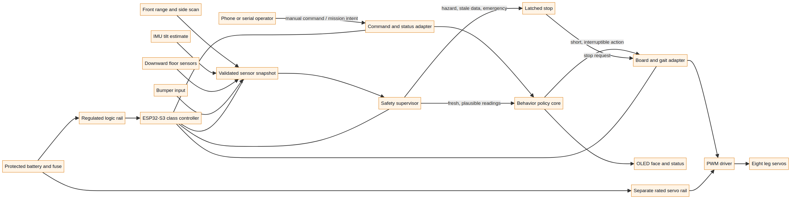

# System architecture (proposed)

The diagram describes an intended layered robot, not an already assembled system. The orange outline differentiates planned components from a completed/tested system only as a visual category; no electronics are wired yet.

## Layer boundaries

1. **Sensor acquisition** will create timestamped readings. Drivers must reject invalid/implausible data and record freshness.
2. **Safety supervisor** takes priority over mission choice. Its policy core is currently host-tested, but hardware input handling and a real stop path are not integrated.
3. **Behavior policy** selects bounded actions. `firmware/kestrel-core/` contains this portable prototype and host tests.
4. **Board/gait adapter** is not implemented. It must map actions to calibrated motions, enforce limits and allow interruption.
5. **Actuators and power** need actual component selection, schematics, power measurements, fusing, and thermal/load validation before movement.
6. **Operator/status** needs a real board adapter and sensor integration; web/mobile status UI is not yet implemented.

Source diagram: [`architecture.mmd`](architecture.mmd). Update it when the actual CAD, pin mapping, board, and tested architecture are known.
